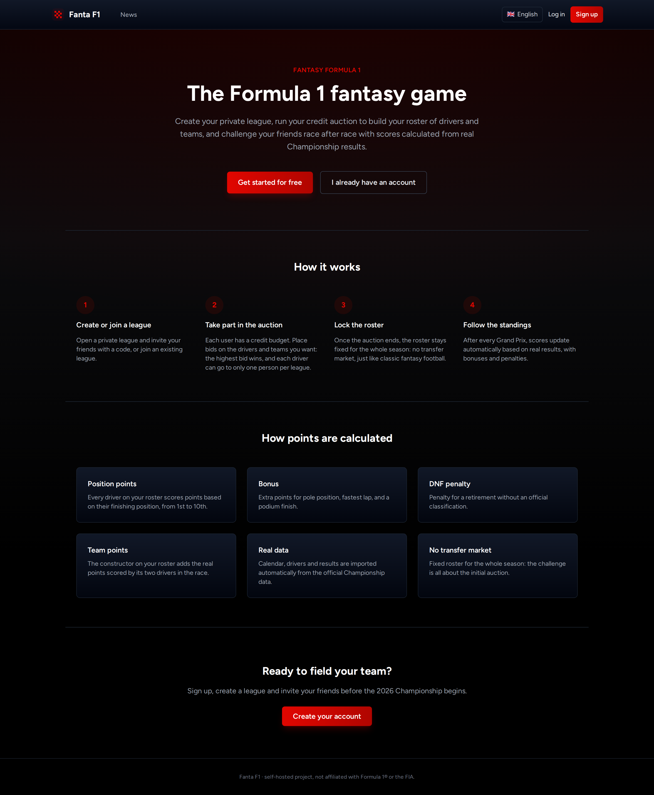
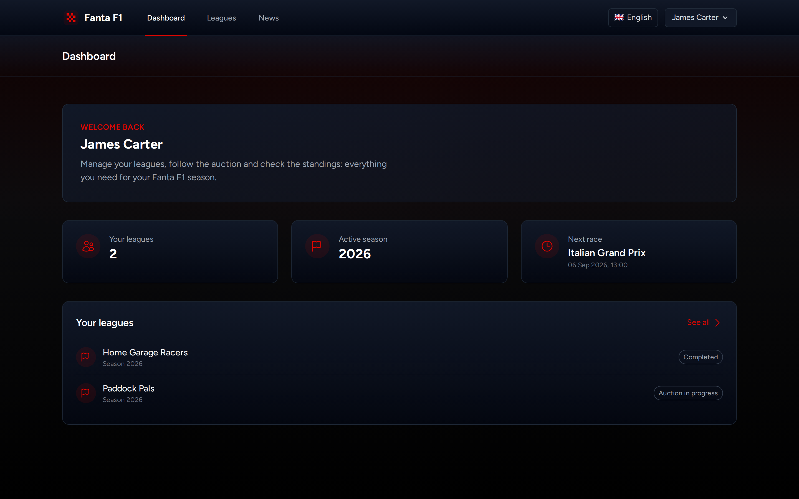
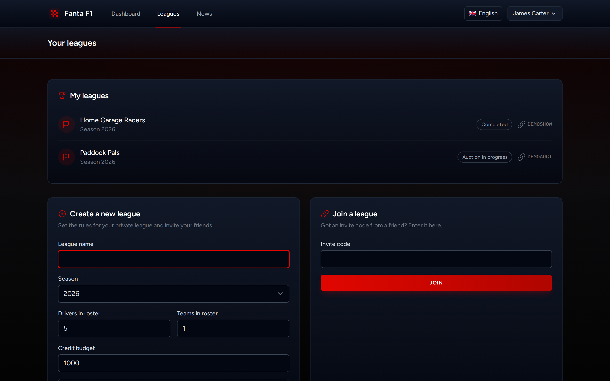
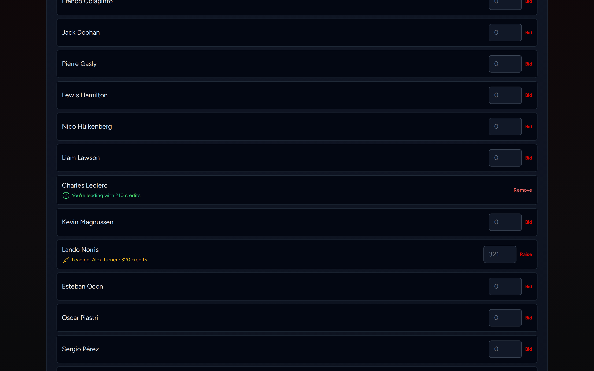
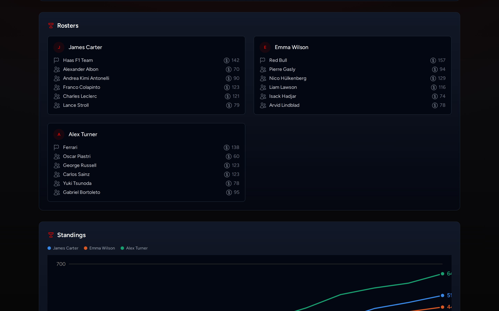
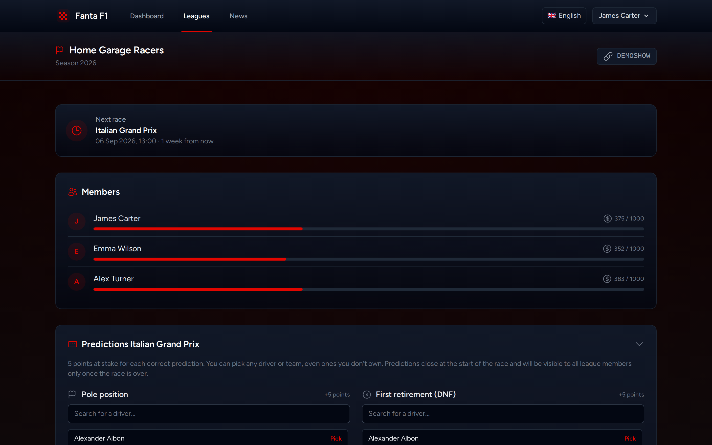
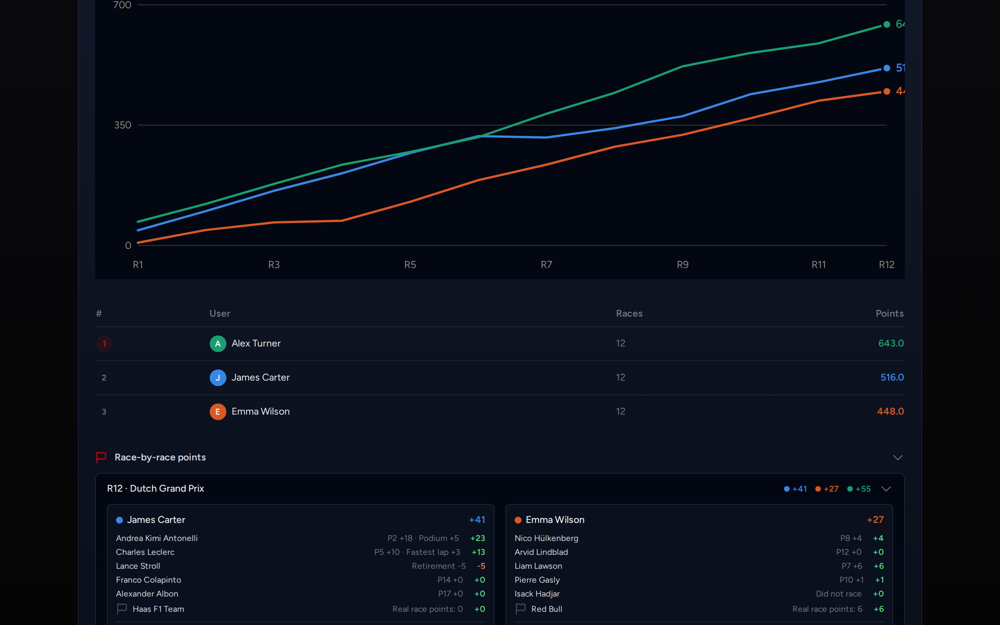
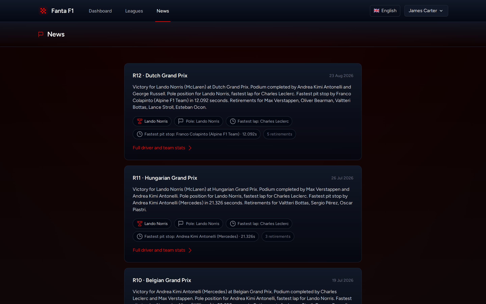
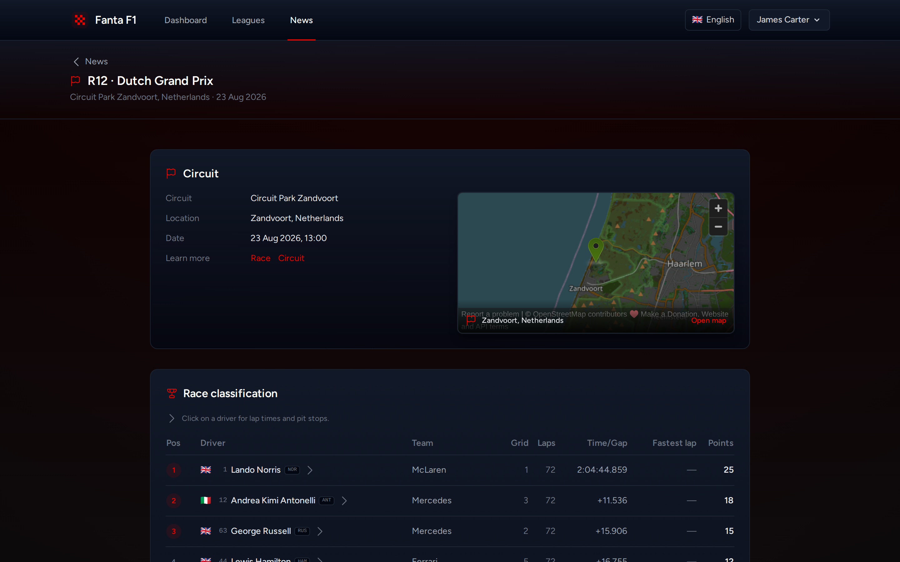
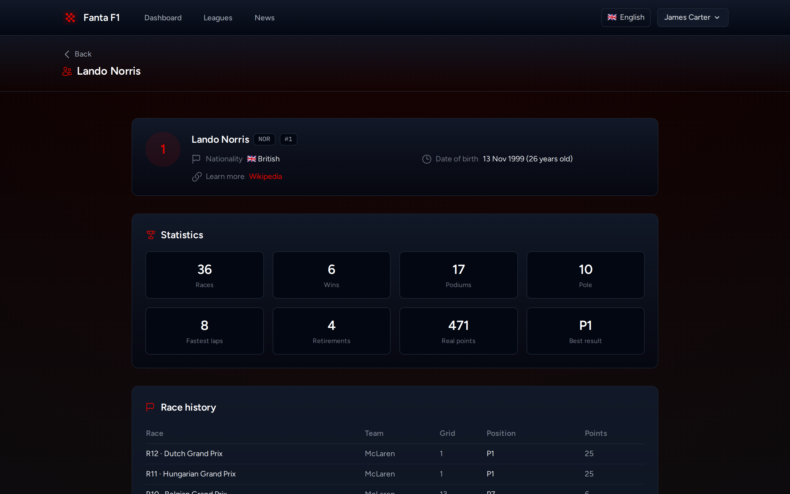

# What Fanta F1 looks like

A visual tour of the main screens. Data and names below are from a demo league, generated just for these images.

## Home

The landing page, visible without an account: what the app is and how it works.

## Dashboard

After logging in: your leagues, the active season, and the next race coming up.

## Create or join a league

Set the name, season, number of drivers/teams per roster, and credit budget — or join an existing league with an invite code.

## Credit auction

Real-time bidding on drivers and teams: highest bid wins, with remaining budget and open slots always visible. "Leading"/"You're winning" makes it instantly clear who's ahead on each driver.

## League roster and standings

Once the auction ends, the league page shows every member's roster (with the price paid for each driver/team) and the overall standings.

## Race-by-race predictions

Before every Grand Prix, each member predicts pole position, first retirement, and fastest pit stop — on any driver or team, even ones they don't own. Everyone's predictions become visible only once the race is over.

## Standings trend and points breakdown

A chart of the season standings race by race, and the breakdown of exactly what each member scored in any single race — drivers, teams, and predictions.

## News

An automatic recap of every finished Grand Prix — winner, podium, pole, fastest lap, fastest pit stop, retirements — visible even without an account.

## Race detail

Circuit with map, full classification with each driver's flag and code, times and pit stops (by clicking on a driver).

## Driver page

Bio, nationality, age, current team, and career stats (wins, podiums, poles, fastest laps, retirements), plus the history of every race raced.

